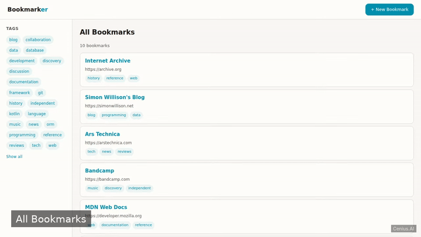
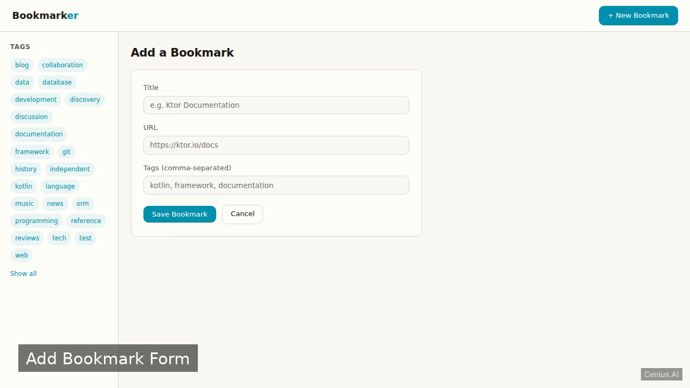

# Bookmarks Ktor Web App — Kotlin/Ktor bookmark to-do list app reference implementation

A self-contained web application for managing browser bookmarks built with Kotlin and Ktor. That's **Bookmarks Ktor Web App** — a Apache-2.0-licensed, open-source bookmark to-do list app in Kotlin/Ktor you can self-host and modify freely. Fork Bookmarks Ktor Web App, run it, or [remix it on cenius.ai](https://cenius.ai/marketplace/p/bookmarks-ktor-web-app?ref=gh&utm_campaign=bookmarks-ktor-web-app-kotlin) for a custom Bookmarks Ktor Web App build with full rebrand rights.


[](LICENSE)  [](https://cenius.ai)

[](https://cenius.ai/marketplace/p/bookmarks-ktor-web-app?ref=gh&utm_campaign=bookmarks-ktor-web-app-kotlin)

> **▶ [Open & edit in cenius.ai](https://cenius.ai/marketplace/p/bookmarks-ktor-web-app?ref=gh&utm_campaign=bookmarks-ktor-web-app-kotlin)** — one click to an editable workspace: describe changes in plain English, get an instant preview, one-click deploy and host. Modifications made on the platform come with full rebrand & relicense rights.

_Local clone? See [Quick start](#quick-start) below. cenius.ai is the zero-setup path._

## Demo



▶ **[Full demo walkthrough](https://cenius.ai/marketplace/p/bookmarks-ktor-web-app?ref=gh&utm_campaign=bookmarks-ktor-web-app-kotlin)** — watch it on the project page · [download MP4](.github/media/demo.mp4)

## Screenshots

  

## Features

- View bookmark list
- Add new bookmark
- Filter by tag

## Quick start

```bash
./install.sh   # installs dependencies + seeds demo data
```

See [`INSTALL.md`](INSTALL.md) for full setup and usage instructions.

## Usage guide

### Starting the Server

Follow the [INSTALL.md](INSTALL.md) guide to launch the application. Once running, open a browser and go to:

```
http://localhost:8080
```

(Replace `8080` with the port you configured via the `PORT` environment variable.)

### Viewing Bookmarks

The home page (`/`) displays a list of all bookmarks. Each entry shows a title, a clickable URL, and its tags. Pre-seeded example bookmarks are included so you can explore immediately.

### Adding a Bookmark

1. Click the **Add Bookmark** link (or navigate to `/add`).
2. Fill in the form with the bookmark's title, URL, and comma-separated tags.
3. Submit the form. The new bookmark will appear on the home page.

### Filtering by Tag

On the home page, click any tag (displayed alongside a bookmark) to filter the list. Only bookmarks with that tag will be shown.

_Full guide: [`USAGE.md`](USAGE.md)_

## Architecture

Kotlin/Ktor project, delivered as a complete runnable codebase (35 files). Top-level layout: `gradle/`, `src/`. Run `./install.sh` once to install packages and populate demo data — the app is ready to use immediately after. Installation walkthrough: [`INSTALL.md`](INSTALL.md).

## FAQ

### How do I self-host Bookmarks Ktor Web App?

Clone this repository and run `./install.sh`, then start the app as described in [`INSTALL.md`](INSTALL.md). Bookmarks Ktor Web App is fully self-hostable — no external services are required to try it.

### What if I want to add features to Bookmarks Ktor Web App without coding?

Describe what you want changed on [cenius.ai](https://cenius.ai/marketplace/p/bookmarks-ktor-web-app?ref=gh&utm_campaign=bookmarks-ktor-web-app-kotlin) — no code editing needed; the platform produces a fresh build you can download and deploy.

### Can I rebrand or white-label Bookmarks Ktor Web App?

Yes. You can edit the source directly under the MIT license, or [remix it on cenius.ai](https://cenius.ai/marketplace/p/bookmarks-ktor-web-app?ref=gh&utm_campaign=bookmarks-ktor-web-app-kotlin) — the platform route grants full rebrand and relicense rights over your derivative.

### Which technology stack does Bookmarks Ktor Web App use?

Bookmarks Ktor Web App is a Kotlin/Ktor application — and this repository holds the complete, runnable source, not a stripped-down sample. Highlights include add new bookmark.

### Can I build a business on Bookmarks Ktor Web App?

Yes — it ships under the Apache-2.0 license, which permits commercial use, modification and redistribution. The full text is in [LICENSE](LICENSE).

## License & rebranding

Released under the [Apache License 2.0](LICENSE) (© 2026 Cenius AI) — free for personal and commercial use. The Cenius name/logo are trademarks (see NOTICE).

**Need a customized version?** [Remix this app on cenius.ai](https://cenius.ai/marketplace/p/bookmarks-ktor-web-app?ref=gh&utm_campaign=bookmarks-ktor-web-app-kotlin) — modifications made on the platform come with **full rebrand & relicense rights** over your derivative.

## Built with cenius.ai

This entire application — code, design, seeded demo data — was generated on **[cenius.ai](https://cenius.ai)** from a plain-English description.

- 🚀 [Build your own app on cenius.ai](https://cenius.ai)
- 🎛️ [Remix Bookmarks Ktor Web App on the marketplace](https://cenius.ai/marketplace/p/bookmarks-ktor-web-app?ref=gh&utm_campaign=bookmarks-ktor-web-app-kotlin) — open it in a workspace, prompt for changes, and ship your own version.

More open-source apps: [the Cenius-ai catalog](https://github.com/Cenius-ai) · [showcase index](https://github.com/Cenius-ai/showcase)
